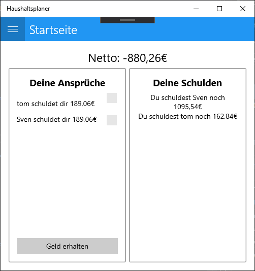
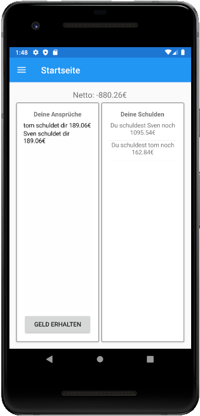
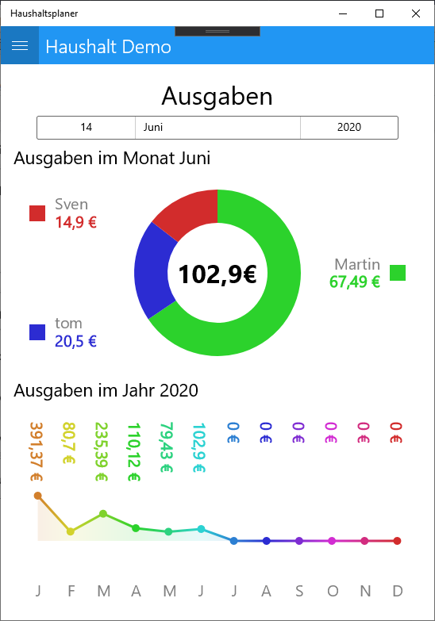
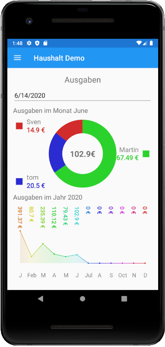
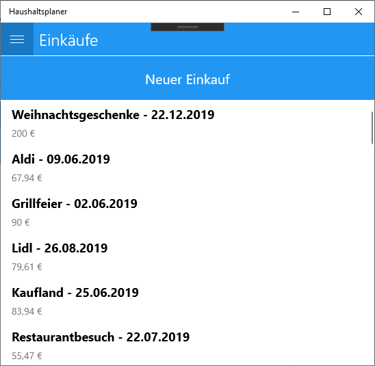
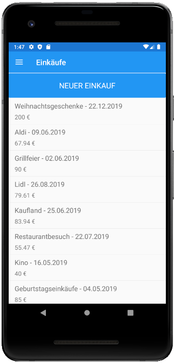
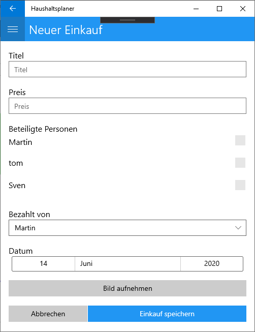
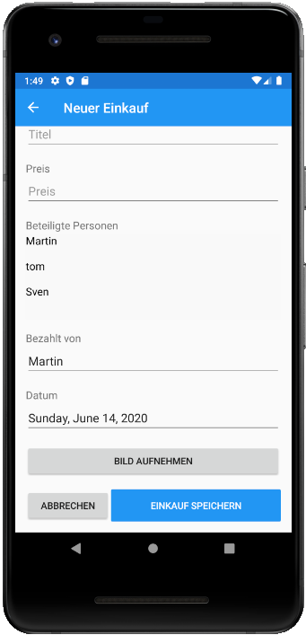

# HHP - Haushaltsplaner (2020)
Haushaltsplaner - Xamarin: Android, Windows

Der Haushaltsplaner zeigt dem Nutzer eine Übersicht seiner Ausgaben und den Ausgaben des Haushalts. Es können Einkäufe hinzugefügt werden und diese einzelnen Personen des Haushalts zugeordnet werden. Die dadurch entstehenden Schulden gegenüber den anderen Haushaltsmitgliedern werden berechnet und angezeigt. Den Einkäufen können Fotos der Kassenbons hinzugefügt werden.

**Entwickelt von:**
 * [Sven Tippner](https://github.com/sventippner)
 * [Martin Ludwig](https://github.com/Martin-Ludwig)
 * [HellShine666](https://github.com/HellShine666)

# Startseite

# Haushalts-Übersicht

# Einkäufe

# Formular, um einen neuen Einkauf einzutragen

